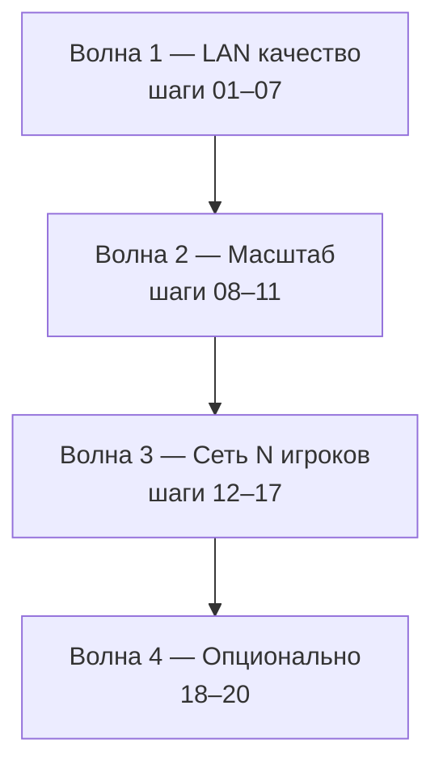

# Единый roadmap: этапы 5 → 6 → 7

**Правило:** шаги выполняются **строго по номеру**. Следующий шаг не начинаем, пока не закрыты критерии приёмки текущего (или явно помеченного как *optional*).

Связанные спеки: [STAGE5](./STAGE5_SCALING.md) · [STAGE6](./STAGE6_EXPERIMENTAL.md) · [STAGE7](./STAGE7_CONTENT_MODS.md) · [STAGE4](./STAGE4_AI_TRAFFIC.md) (уже в коде).

---

## Сводная таблица (источник правды)

| Шаг | Фаза | Этап | Содержание | Режим | Блокирует |
|-----|------|------|------------|-------|-----------|
| **01** | 7.4 | 7 | Shared garage preset | LAN + dedicated | — |
| **02** | 7.3 | 7 | `config_truncated` + UI «друг видит stock» | LAN + dedicated | — |
| **03** | 5.0.5.1–3 | 5 | Версии, reconnect, смена машины | LAN + dedicated | 05 |
| **04** | 5.0.5.4–6 | 5 | Прицепы, пароль LAN, roster, nametag | LAN + dedicated | 08 |
| **05** | 7.1 | 7 | `mods_hash` / warning automation | LAN + dedicated | 10 |
| **06** | 7.2 | 7 | Кастомные карты + preload / missing UI | LAN + dedicated | 10 |
| **07** | 6.7 | 6 | Гонки, countdown, конвой, vote | LAN + dedicated | — |
| **08** | 5.0 | 5 | Протокол v2, `BREL`, multi-peer | dedicated (+ LAN) | 09, 12 |
| **09** | 5.1 | 5 | C++ UDP relay | dedicated | 10, 12 |
| **10** | 5.2 | 5 | Matchmaking API + UI + онбординг | dedicated | — |
| **11** | 5.3 | 5 | Docker / CI / `PLAYER_GUIDE` / тесты | ops | — |
| **12** | 6.3 | 6 | Interest grid на relay | dedicated | 14 |
| **13** | 6.4 | 6 | Bandwidth governor | оба | 14 |
| **14** | 6.1 | 6 | Proximity VoIP (bridge) | оба | 15, 17 |
| **15** | 6.5 | 6 | PTT / рация / mute | оба | — |
| **16** | 6.8 | 6 | Spectator | dedicated | — |
| **17** | 6.9 | 6 | i18n, privacy (voice), police backlog | оба | — |
| **18** | 6.2 | 6 | NAT STUN/TURN | WAN P2P only | *optional* |
| **19** | 6.6 | 6 | DPUB delta compression | оба | *optional* |
| **20** | 5.4 | 5 | Telemetry dashboard | ops | *optional* |

**Исключено навсегда:** anti-cheat (бывш. 5.5) — только rate-limit на relay.

---

## Волны релиза (milestones)



| Волна | Шаги | Результат для игрока |
|-------|------|----------------------|
| **1 — LAN качество** | 01–07 | Пресеты, понятный config, стабильная сессия 1×1, моды/карты, гонки |
| **2 — Масштаб** | 08–11 | 8–16 на dedicated, список серверов, деплой |
| **3 — Сеть N игроков** | 12–17 | Меньше трафика, голос, spectator, полировка UI |
| **4 — Опционально** | 18–20 | NAT без relay, delta DPUB, телеметрия |

---

## Зависимости (кратко)

```
01 → 02 → 03 → 04 → 05 → 06 → 07
                          ↓
08 → 09 → 10 → 11
          ↓
         12 → 13 → 14 → 15
          ↘      ↗
           16, 17
18, 19, 20 — в любой момент после нужной базы (см. таблицу)
```

- **Шаг 03** расширяет handshake — нужен для **05** (`mods_hash` в том же `connect`).
- **Шаг 10** в register/list использует **05**, **06** (`mods_hash`, `map_title`).
- **Шаг 12** имеет смысл только после **09** (relay с N клиентами).
- **Шаг 14** (VoIP) — после **08** (позиции N игроков); желательно после **12**.

---

## Что в каком документе

| Документ | Шаги | Роль |
|----------|------|------|
| [STAGE7](./STAGE7_CONTENT_MODS.md) | **01–02, 05–06** | Контент: пресет, config, моды, карты |
| [STAGE5](./STAGE5_SCALING.md) | **03–04, 08–11, 20** | Сессия, протокол, relay, API, ops |
| [STAGE6](./STAGE6_EXPERIMENTAL.md) | **07, 12–19** | Геймплей, VoIP, culling, polish |

---

## Критерии «v5.0 готов к публичному dedicated»

1. Волна **1** закрыта (шаги 01–07).
2. Волна **2** закрыта (08–11).
3. Минимум из волны **3**: **12** + **13** (без VoIP можно, но трафик должен быть контролируем).

---

## Порты и модули (сквозь этапы)

| Порт / артефакт | Шаг |
|-----------------|------|
| `27015` game UDP | as-is → **08** `BREL` |
| `27019` LAN discovery | as-is (LAN-only) |
| `3000` matchmaking API | **10** |
| `sessionSync.lua` | **03–04** |
| `vehicleSync.lua` | **04** |
| `contentSync.lua` | **01–02, 05–06** |
| `networkTransport.lua` | **08** |
| `raceSync` / `gameplaySync` | **07** |
| `server/` relay | **09**, **12** |
| `voiceSync` + bridge | **14–15** |
